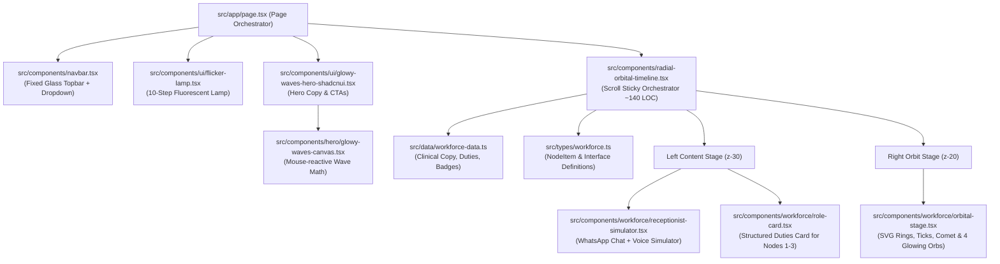
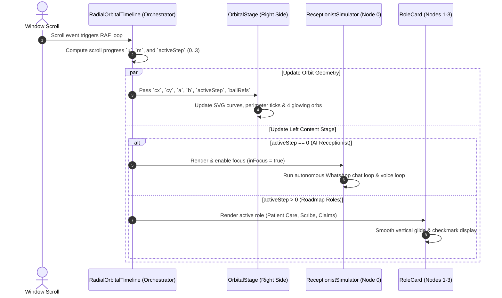

# OperinLabs Component Architecture & Modular Breakdown

> **Document Status**: Approved Blueprint  
> **Date**: October 2026  
> **Target Version**: Next.js 15 / React 19 / TypeScript  
> **Repository**: `OperinLabs`

---

## 1. Executive Summary

This document specifies the modular refactoring plan for the OperinLabs frontend application. The primary objective is to decompose monolithic single-file components (most notably the **1,042-line** `radial-orbital-timeline.tsx` and **332-line** `glowy-waves-hero-shadcnui.tsx`) into clean, single-responsibility, highly reusable modules while preserving **100% of existing animations, physics calculations, and visual aesthetics**.

---

## 2. Current Codebase Metrics & Pain Points

### 2.1 File Line Distribution

| File | Current LOC | % of Codebase | Primary Responsibility | Architectural Issue |
| :--- | :---: | :---: | :--- | :--- |
| **`src/components/radial-orbital-timeline.tsx`** | **1,042** | **54.0%** | Timeline orbit physics, data, SVG rendering, WhatsApp chat simulator, voice simulator, roadmap role cards | **Monolithic Bottleneck**: Combines math, static copy, timer choreography, and UI rendering in one file. |
| **`src/components/ui/glowy-waves-hero-shadcnui.tsx`** | **332** | **17.2%** | Hero section canvas wave physics + headline copy + CTAs | Couples canvas trigonometric simulation with DOM layout. |
| **`src/app/globals.css`** | 126 | 6.5% | Global styles, token themes & keyframes | Healthy size; contains CSS variables. |
| **`src/components/ui/flicker-lamp.tsx`** | 123 | 6.4% | Fluorescent lamp flicker & volumetric beam | Clean single-responsibility module. |
| **`src/components/navbar.tsx`** | 97 | 5.0% | Fixed glass header with top dropdown nav | Clean single-responsibility module. |
| **`src/components/ui/lamp-light-bar.tsx`** | 92 | 4.8% | Legacy Aceternity lamp | **Dead code** (unused; replaced by `flicker-lamp.tsx`). |
| **`src/components/ui/button.tsx`** | 57 | 3.0% | Shadcn UI button primitive | Reusable atomic component. |
| **`src/app/layout.tsx`** | 35 | 1.8% | Root HTML metadata & font setup | Healthy. |
| **`src/app/page.tsx`** | 20 | 1.0% | Main page layout assembler | Clean. |
| **`src/lib/utils.ts`** | 6 | 0.3% | Tailwind merge utility | Healthy. |
| **Total** | **1,930** | **100%** | | |

---

## 3. Architecture Diagrams

### 3.1 Component Hierarchy & Tree Diagram



---

### 3.2 Workforce Data & Animation Flow Diagram



---

## 4. Target Directory Structure

```
src/
├── app/
│   ├── globals.css                       # Global styles & keyframe animations
│   ├── layout.tsx                        # Root layout with Geist & font variables
│   └── page.tsx                          # Assembles Navbar, Lamp, Hero & Timeline
│
├── types/
│   └── workforce.ts                      # NodeItem, Modality & Status TypeScript types
│
├── data/
│   └── workforce-data.ts                 # Clean clinical copy, duties, badges & pills
│
├── components/
│   ├── navbar.tsx                        # Fixed dark glass header & dropdown top nav
│   ├── radial-orbital-timeline.tsx       # Core orchestrator (~140 LOC, reduced from 1,042)
│   │
│   ├── hero/
│   │   └── glowy-waves-canvas.tsx        # Isolated canvas wave physics simulation
│   │
│   ├── workforce/
│   │   ├── receptionist-simulator.tsx    # Dual-modality WhatsApp Chat & Voice Call simulator
│   │   ├── role-card.tsx                 # Structured role presentation for Nodes 1, 2, and 3
│   │   └── orbital-stage.tsx             # SVG orbit rings, ticks, comet & 4 glowing orbs
│   │
│   └── ui/
│       ├── button.tsx                    # Atomic Shadcn UI button
│       └── flicker-lamp.tsx              # Cinematic overhead fluorescent flicker lamp
│
└── lib/
    └── utils.ts                          # clsx & tailwind-merge helper
```

---

## 5. Detailed Module Specifications

### 5.1 `src/types/workforce.ts`
- **Estimated LOC**: ~25 lines
- **Responsibility**: Pure TypeScript type contracts.
- **Exports**:
  ```ts
  export interface NodeItem {
    id: number
    key: "receptionist" | "coordinator" | "scribe" | "claims"
    title: string
    subtitle: string
    badge: "Live" | "Coming live soon"
    icon: React.ElementType
    description: string
    pills: string[]
    duties?: string[]
  }

  export type ReceptionistTab = "chat" | "voice"
  ```

---

### 5.2 `src/data/workforce-data.ts`
- **Estimated LOC**: ~75 lines
- **Responsibility**: Single source of truth for all role metadata, clinical copy, duties arrays, and badges.
- **Exports**:
  - `NODES_DATA: NodeItem[]`: Array containing:
    1. **AI Receptionist** (Front desk, Live)
    2. **AI Patient Care Coordinator** (Between visits, 3 duties, Coming live soon)
    3. **Clinical AI Scribe** (In the consultation, 3 duties, Coming live soon)
    4. **AI Claims Associate** (After the visit, 3 duties, Coming live soon)

---

### 5.3 `src/components/workforce/receptionist-simulator.tsx`
- **Estimated LOC**: ~240 lines (extracted from lines 659–994 of `radial-orbital-timeline.tsx`)
- **Responsibility**: Encapsulates the entire dual-modality clinical preview.
- **Internal State & Features**:
  - Tab state: `activeReceptionistTab` (`"chat"` | `"voice"`).
  - WhatsApp chat loop (Raj Silchar ↔ OperinLabs, typing bounce dots, booking preview popover, confirmed badge).
  - AI Voice Call loop (Priyanka Guwahati, 11 connecting dots, 9-bar cobalt blue soundwave, turn-by-turn dialogue, resolved badges).
  - Timer lifecycles that only loop when `inFocus={true}`.
- **Props**:
  ```ts
  interface ReceptionistSimulatorProps {
    inFocus: boolean
  }
  ```

---

### 5.4 `src/components/workforce/role-card.tsx`
- **Estimated LOC**: ~55 lines (extracted from lines 995–1035 of `radial-orbital-timeline.tsx`)
- **Responsibility**: Presentation component for roadmap AI employees (Nodes 1, 2, 3) directly on the dark presentation canvas without a white box.
- **Props**:
  ```ts
  interface RoleCardProps {
    node: NodeItem
  }
  ```
- **Structure**:
  - Title (`text-2xl sm:text-3xl lg:text-[34px] font-extrabold text-white`)
  - Subtitle (`text-sm sm:text-base text-[#AEB5CA] mb-8`)
  - Tracked uppercase subheading (`DUTIES & RESPONSIBILITIES`)
  - Checkmark bullet items (`gap-4 sm:gap-5 mb-9` with `Check text-blue-400`)
  - Status pill badge (`Coming live soon`)

---

### 5.5 `src/components/workforce/orbital-stage.tsx`
- **Estimated LOC**: ~140 lines (extracted from lines 450–578 of `radial-orbital-timeline.tsx`)
- **Responsibility**: Pure rendering of the right-side orbital geometry.
- **Props**:
  ```ts
  interface OrbitalStageProps {
    activeStep: number
    onNodeClick: (index: number) => void
    ringRef: React.RefObject<SVGEllipseElement | null>
    dialRef: React.RefObject<SVGEllipseElement | null>
    innerRef: React.RefObject<SVGEllipseElement | null>
    glowRef: React.RefObject<HTMLDivElement | null>
    tickRefs: React.MutableRefObject<(HTMLDivElement | null)[]>
    cometRef: React.RefObject<HTMLDivElement | null>
    ballRefs: React.MutableRefObject<(HTMLDivElement | null)[]>
    labelRefs: React.MutableRefObject<(HTMLDivElement | null)[]>
  }
  ```

---

### 5.6 `src/components/radial-orbital-timeline.tsx` (Orchestrator)
- **Estimated LOC**: ~140 lines (**down from 1,042 lines — 86% reduction!**)
- **Responsibility**:
  - Sticky viewport container (`h-[400vh]` scroll track with `sticky top-0 h-screen`).
  - RequestAnimationFrame loop managing scroll-progress geometry (`a`, `b`, `cx`, `cy`).
  - Directional gliding transitions between active cards (`translateY(0px)`, `translateY(-32px)`, `translateY(32px)`).
  - Clean composition:
    ```tsx
    <section ref={secRef} id="workforce">
      {/* 1. Header (Fixed top-left, fades on scroll) */}
      <WorkforceHeader ref={headerRef} />

      {/* 2. Left Stage: Centered Vertically, Left-Corner Horizontal Alignment */}
      <div className="absolute inset-y-0 left-6 sm:left-12 lg:left-16 z-30 flex items-center justify-start">
        {NODES_DATA.map((node, i) => (
          <div key={node.id} style={{ opacity: activeStep === i ? 1 : 0, transform: getTranslateY(i) }}>
            {i === 0 ? <ReceptionistSimulator inFocus={isReceptionistInFocus} /> : <RoleCard node={node} />}
          </div>
        ))}
      </div>

      {/* 3. Right Stage: Mathematical Orbital Ferris Wheel */}
      <OrbitalStage activeStep={activeStep} onNodeClick={handleNodeClick} {...refs} />
    </section>
    ```

---

### 5.7 `src/components/hero/glowy-waves-canvas.tsx`
- **Estimated LOC**: ~140 lines (extracted from `glowy-waves-hero-shadcnui.tsx`)
- **Responsibility**: Encapsulates the HTML5 `<canvas>` mouse-influence wave math, requestAnimationFrame draw loop, and resize handlers.

---

### 5.8 Cleanup Target: Delete `src/components/ui/lamp-light-bar.tsx`
- **Action**: Delete file.
- **Rationale**: 92 lines of legacy Aceternity lamp code completely superseded by the authentic 10-step `flicker-lamp.tsx`.

---

## 6. Implementation & Migration Steps

```mermaid
gantt
    title Refactoring Execution Sequence
    dateFormat  X
    axisFormat %s

    section Phase 1: Foundations
    Extract workforce types          :p1, 0, 1
    Extract workforce dataset        :p2, 1, 2

    section Phase 2: Workforce Breakdown
    Build receptionist-simulator.tsx :p3, 2, 3
    Build role-card.tsx              :p4, 3, 4
    Build orbital-stage.tsx          :p5, 4, 5
    Simplify radial-orbital-timeline :p6, 5, 6

    section Phase 3: Hero Breakdown & Cleanup
    Extract glowy-waves-canvas.tsx   :p7, 6, 7
    Delete dead lamp-light-bar.tsx   :p8, 7, 8

    section Phase 4: Validation
    Run TypeScript compilation check :p9, 8, 9
    Verify headless Chrome render    :p10, 9, 10
```



---

## 7. Quality Assurance & Verification

1. **Compilation Gate**:
   - `npx tsc --noEmit` must pass with zero errors.
2. **Visual Fidelity Gate**:
   - Headless Chrome captures of:
     - Node 0 (AI Receptionist interactive WhatsApp and phone modes).
     - Nodes 1–3 (Airy, unboxed structured role cards with blue checkmarks).
     - Overhead flicker lamp on load and during scroll.
     - Top navbar dropdown toggling.
3. **Animation Smoothness Gate**:
   - 60fps scroll responsiveness with passive event listeners and RAF batching.
